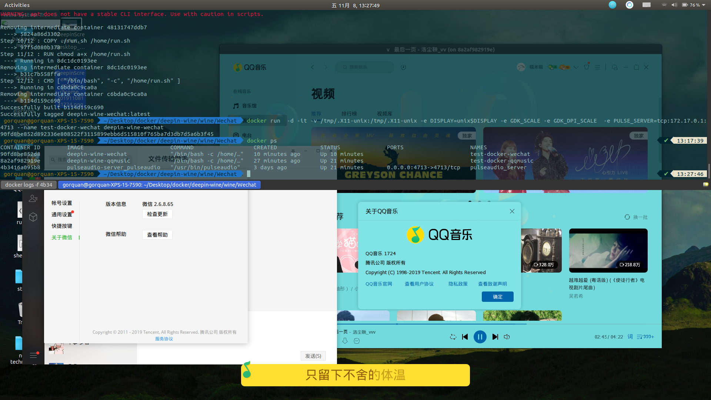

# deepin-wine-docker

* 简介
    能够在docker中运行wine程序，并能够显示画面和播放声音。

* 使用前注意
    1. ~~部分系统没有`ifconfig`命令，使用前先确保能够使用`ifconfig`命令再执行脚本。(以后将改为`ip addr`)~~ 已经更换为`ip addr`
    2. 容器均基于ubuntu进行封装，请先前往[DaoCloud](https://www.daocloud.io/mirror#accelerator-doc)安装Docker镜像站或者先执行`docker pull ubuntu`下载ubuntu容器镜像。
    3. 请执行`chmod a+x command.sh`赋予脚本执行权限，否则脚本无法执行。
    4. 请先执行`./command.sh -i`初始化pulseaudio-server,否则容器无法输出声音。

* 使用方法
``` shell
# 初始化或启动pulseaudio-server
$ ./command.sh -i
start xhost successfully..
pulseaudio server start successfully..

# 运行容器或重启程序
$ ./command.sh -r appliactionName
# ./command.sh -r wechat
start xhost successfully..
start to start applicationName application
start applicationName container successfully..
# start xhost successfully..wenjian
# start to start qqmusic application
# start qqmusic container successfully..

# 关闭程序
$ ./command.sh -s applicationName

# 关闭pulseaudio-server
$ ./command.sh -c 
start xhost successfully..
stop application successfully.. now start to stop pulseaudio-server..
stop pulseaudio server successfully..

# 卸载方法
$ ./command.sh -d

# 容器升级
$ ./command.sh -u
```

* 待完成清单列表
    - [x] 卸载容器
    - [x] 容器升级
    - [ ] 文件夹挂载问题
    - [x] 时间问题
    - [x] pulseaudio-server 启动判断
    - [x] ifconfig 改为 ip addr
    - [ ] 挂载麦克风
    - [ ] 挂载摄像头
    - [ ] ...


* 应用测试列表
    - [x] TIM
    - [x] QQ音乐
    - [x] 微信
    - [ ] 迅雷
    - [ ] ...

* 采用技术
    * pulseaudio-server
    * docker
    * docker-compose
    * deepin-wine
    * X11
    

* 常见问题
    * wine程序图标托盘问题
        * Gnome环境： 安装Gnome Shell插件： [TopIcons Plus](https://extensions.gnome.org/extension/1031/topicons/)
    * wine程序运行中闪退
        * 由于wine的不稳定性，运行中程序可能会出现闪退现象，执行`./command.sh -r applicationName`重新打开软件即可
    * wine程序没有声音或提示不存在声卡
        * 因为一些操作问题（例如启动声卡后插入耳机），会导致docker中声音无法输出。此情况请先执行`./command.sh -c` 关闭wine程序容器和pulseaudio-server容器，再执行`./command.sh -i` 初始化pulseaudio-server，最后执行`./command.sh -r applicationName` 运行应用。


* issue与pull requests
    * 如果遇到问题或有好的建议，欢迎提交[issue](https://github.com/gorquan/deepin-wine-docker/issues)
        * 注意： 提交issue请提供信息，如不按照以下格式，一律关闭issue
            1. 运行平台(例：Ubuntu 18.04)
            2. 运行软件(例：Wechat)
            3. 错误信息及截图
    * 如果有好的想法并实现了，欢迎提交pr
        * 参与本项目
            1. Fork本分支
            2. 新建 Feat_username 分支
            3. 提交代码issue
            4. 新建Pull Requests

* 二次开发
    * 本源码已经提供模板Dockerfile，开发者可以根据General文件夹中的Dockerfile定制自己的wine容器

* 运行截图
    * 

* 感谢
    * [wszqkzqk/deepin-wine-ubuntu](https://github.com/wszqkzqk/deepin-wine-ubuntu)
    * [Jactor-Sue/Deepin-Apps-Installation](https://github.com/Jactor-Sue/Deepin-Apps-Installation)
    * [RokasUrbelis/docker-wine-linux](https://github.com/RokasUrbelis/docker-wine-linux)
    * [Deepin](https://www.deepin.org/zh/)

* 说明
    * deepin-wine产品为deepin公司所有
    * TIM、QQMusic、Wechat产品为Tencent公司所有
    * 本源码仅为学习使用，未经允许不能用于商业用途，如有侵权请提交issue进行删除
